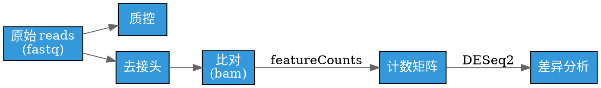
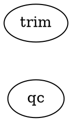
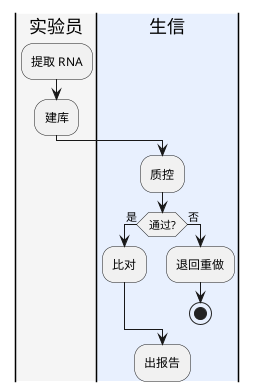
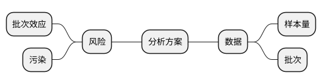

# 把分析流程画成专业图表

## 什么时候用这条技能

用户说「画个流程图 / 架构图 / 管线图 / 示意图 / 思维导图」，或你需要把一段流程、
一套实验设计、一个目录层级、一条数据管线讲清楚时，按本文走。生信场景里最常见四种：
**分析管线**（原始数据 → 质控 → 比对 → 定量 → 差异分析 → 富集）、**实验设计**
（样本/分组/批次/时间点）、**样本流转**（收样 → 建库 → 测序 → 分析 → 报告，跨角色）、
**系统结构**（工具链分层、模块依赖、目录树）。

不适用：需要三维、交互式仪表盘、或数据本身还没跑出来时。

**核心原则**：图是**文本源码**，源码是主件，图片是派生物。永远同时给源码和渲染结果——
用户改一个词就能重排整张图，不用重画。

---

## 第一步：选图种

按「你要表达什么关系」选，不要凭喜好。

| 关系类型 | 选它 | 围栏 | 离线出图 |
|---|---|---|---|
| 有向依赖：谁产出谁、调用链、目录树、模块依赖 | **Graphviz DOT** | ` ```dot ` | ✅ `dot` 二进制，最稳 |
| 带分支/并发/汇合的流程 | **PlantUML 活动图** | ` ```plantuml ` | ✅ Java + jar |
| 跨角色的流程、审批链、消息驱动 | **BPMN / EIP** | ` ```plantuml ` | ✅ 同上，但有 stencil 陷阱 |
| 分层系统架构（用户/应用/数据/基础设施） | **HTML 分层模板** | 无围栏裸 HTML | ✅ 直接 .html |
| 层级分解、大纲、决策树 | **PlantUML mindmap** | ` ```plantuml ` | ✅ Java + jar |
| 企业架构（业务/应用/技术三层） | **ArchiMate** | ` ```plantuml ` | ✅ stdlib 内置于 jar |
| 自由摆放的概念图、知识图、规划板 | **JSON Canvas** | ` ```canvas ` | ⚠️ 无 CLI，需自写渲染 |
| 数值数据的柱/线/散点/热图 | **Vega-Lite** | ` ```vega-lite ` | ✅ `vl-convert` |
| KPI 卡、时间线、对比卡 | infographic / infocard | ` ```infographic ` / 裸 HTML | ⚠️ 主要作预览 |

**不确定就用 Graphviz DOT。** 它语法最短、渲染失败率最低、离线一定有工具，「节点 + 有向边」
能覆盖分析场景里八成的图。只有需要**多角色泳道**或**并发/汇合语义**时才升级到 PlantUML / BPMN。

---

## 第二步：通用工作流（五步，顺序不要换）

1. **先列节点和边，别先想语法。** 用最朴素的方式写下来：

   ```
   节点：fastq / qc_report / trimmed / bam / counts / de_table
   边：fastq->qc_report, fastq->trimmed, trimmed->bam, bam->counts, counts->de_table
   ```

   这一步做完，图长什么样就已经定了。跳过它直接写语法，必然来回返工。

2. **定方向。** 流程/管线 → 从左到右（DOT `rankdir=LR`，PlantUML `left to right direction`）；
   层级/树/依赖 → 从上到下（DOT 默认 `rankdir=TB`）。
3. **分组。** 同一阶段的节点放进一个子图/矩形，组名写人能读懂的短语（`rectangle "质控" { }`）。
   没有分组的大平面图几乎一定难看。
4. **写源码 → 渲染 → 看结果。** 每改一次就渲染一次，别攒着改十处再看。报错先看行号，
   那里通常是缺分号、缺逗号或名字不对。
5. **交付**：`.md` 源码 + `.svg`（或 `.png`）+ 一行再生成命令，三者缺一不可。

---

## 第三步：Graphviz DOT（默认首选）

````markdown

````

围栏是 **` ```dot `，不是 ` ```graphviz `**。用错围栏不会渲染。

**语法硬规则**（每条都对应一种渲染失败）：

| 规则 | 错误写法 | 正确写法 |
|---|---|---|
| 有向/无向 | `graph` + `->` | 有向 `digraph` + `->`；无向 `graph` + `--` |
| 子图必须是 cluster | `subgraph backend {}` | `subgraph cluster_backend {}`（**必须**以 `cluster_` 开头才画成框） |
| 含空格的 ID | `API Gateway [label="API"]` | `"API Gateway" [label="API"]` 或 `api_gateway [label="API Gateway"]` |
| 属性分隔 | `node [shape=box color=red]` | `node [shape=box, color=red];`（**逗号**分隔，末尾分号） |
| HTML 标签 | `shape=box` + `<...>` | `shape=plaintext` + 用 `< >` 而不是引号 |

**布局三旋钮**：



- 图太宽 → 换 `rankdir=TB`；图太长 → 换 `rankdir=LR`。
- 某条边不该影响层级 → `A -> B [constraint=false]`；想让边拉长 → `[minlen=2]`。
- 分支交叉严重 → 先试 `splines=ortho`，再调**节点声明顺序**（声明顺序决定同层内的排列）。

**形状**：`box` 处理步骤 / `diamond` 判断分支 / `cylinder` 数据库存储 / `folder` 目录集合 /
`component` 模块组件 / `circle` 状态事件 / `plaintext` 纯标签 / `record` 结构化数据表。

**固定调色板**（照用，别自己调）：绿 `#2ECC71` 完成 · 红 `#E74C3C` 错误关键 · 橙 `#F39C12`
警告待办 · 蓝 `#3498DB` 信息处理 · 灰 `#95A5A6` 中性停用 · 紫 `#9B59B6` 概念 · 青 `#1ABC9C`
次要 · 黄 `#F1C40F` 高亮。

**结构化节点**（表格型，注意 Graphviz 属性用大写且不用引号）：

```dot
node [shape=plaintext];
qc_tbl [label=<
  <TABLE BORDER="0" CELLBORDER="1" CELLSPACING="0">
    <TR><TD BGCOLOR="#3498DB"><FONT COLOR="white">样本</FONT></TD><TD>通过率</TD></TR>
    <TR><TD>S1</TD><TD>97.2%</TD></TR>
  </TABLE>>
];
```

---

## 第四步：PlantUML 系（活动图 / BPMN / 思维导图 / ArchiMate）

```plantuml
@startuml
left to right direction
rectangle "质控" {
  rectangle "FastQC" as fq
  rectangle "MultiQC" as mq
}
rectangle "比对" { rectangle "BWA" as bwa }
fq --> mq
mq --> bwa
@enduml
```

- 必须以 `@startuml` 开头、`@enduml` 结尾（思维导图是 `@startmindmap` / `@endmindmap`）。
- **围栏只认 ` ```plantuml ` 或 ` ```puml `**。写成 ` ```text ` 就只是文本，永远不渲染。
- 连线语义：`-->` 实线箭头 = 顺序流/主数据流；`..>` 虚线箭头 = 消息流/异步/跨泳道触发；
  `--` 无箭头 = 双向同步。加标签：`A --> B : "条件"`。

### BPMN：泳道与网关

BPMN 的价值在**跨角色**和**并发/汇合**，普通单向管线不要用它。

- **池/泳道**用 `rectangle "池名" { ... }` 包住属于该角色/服务的节点。
- **事件**（圆形）：`.start` / `.end` / `.timerStart` 定时触发 / `.errorEnd` 错误结束 /
  `.messageCatching` 消息捕获，前缀 `mxgraph.bpmn.event.`。
- **网关**（菱形）：`mxgraph.bpmn.gateway2.exclusive`（XOR 二选一）、`.parallel`（AND 并发
  分叉/汇合）、`.inclusive`（OR）。
- **任务**：`mxgraph.bpmn.user_task`（人工）、`.service_task`（自动）、`.script_task`、
  `.business_rule_task`（规则判断）。
- **集成模式 EIP**：`mxgraph.eip.splitter` / `.aggregator` / `.content_based_router` /
  `.message_translator` / `.deadLetterChannel`（失败队列）/ `.channel_adapter`。
- **值流图 Lean**：`mxgraph.lean_mapping.manufacturing_process` / `.inventory_box` /
  `.truck_shipment` / `.kaizen_lightening_burst`。

**跨池用虚线，池内用实线**——这是 BPMN 的硬约定，破坏它图就没人看得懂。

```plantuml
@startuml
left to right direction
mxgraph.bpmn.event.start "收到样本" as start
mxgraph.bpmn.gateway2.exclusive "量够吗?" as gw
rectangle "实验组" { mxgraph.bpmn.user_task "建库" as lib }
rectangle "测序组" { mxgraph.bpmn.service_task "上机" as seq }
start --> gw
gw --> lib : "是"
gw --> start : "否，补样"
lib ..> seq : "送测"
@enduml
```

### 活动图（带泳道）

用 `|泳道名|` 切换当前泳道，动作用 `:文字;`：



### 思维导图



- 层级靠星号数量：`*` 根、`**` 一级、`***` 二级。同一分支内**不要混用** `*` 和 `+/-` 两种记号。
- `left side` 之后的分支长到左边，用来做「正面 vs 风险」这种双侧图。
- 多行文本必须用块语法 `**:第一行\n第二行;`（结尾分号不能少）。
- 快速上色 `**[#FFCDD2] 风险点`；状态色：绿 `#C8E6C9` 完成 / 黄 `#FFF9C4` 进行中 /
  红 `#FFCDD2` 阻塞 / 灰 `#E0E0E0` 未开始。避免纯饱和色，根节点可用亮色，其余用柔和色。

### ArchiMate（企业架构三层）

```plantuml
@startuml
!include <archimate/Archimate>
rectangle "业务层" {
  Business_Process(seq_run, "测序流程")
  Business_Service(seq_svc, "测序服务")
}
rectangle "应用层" { Application_Component(pipe, "分析管线") }
rectangle "技术层" { Technology_Node(hpc, "HPC 集群") }
Rel_Triggering(seq_run, seq_svc, "触发")
Rel_Realization(pipe, seq_svc, "实现")
Rel_Assignment(hpc, pipe, "运行于")
@enduml
```

- **必须**先 `!include <archimate/Archimate>`，否则所有宏都报未定义。
- 元素宏 `层_类型(别名, "标签")`。层前缀：`Business_` / `Application_` / `Technology_` /
  `Motivation_` / `Strategy_` / `Implementation_`。
- 关系宏 `Rel_类型(起点, 终点, "标签")`。关键几个：`Rel_Composition`（组合，实心菱形）、
  `Rel_Realization`（实现，虚线空心三角）、`Rel_Serving`（服务，实线箭头）、`Rel_Triggering`
  （触发）、`Rel_Flow`（流转，虚线）、`Rel_Access_r` / `Rel_Access_w`（读写，点线）。
- 后缀 `_Up` / `_Down` / `_Left` / `_Right` 控制关系绘制方向。

### ⚠️ stencil 陷阱（本技能最重要的一条）

`mxgraph.*` 图标（BPMN / EIP / AWS / Cisco / Kubernetes 等 9000+ 个）**是这个技能原本面向的
Markdown 预览器自带的扩展**，标准 PlantUML 发行版不认这些名字。后果：同一段源码在预览器里
有一堆漂亮图标，用普通 `plantuml.jar` 渲染时一片报错或全变成空白框。

**按交付目标二选一，永远不要混在一份源码里**：

- 交付**图片文件** → 只用标准关键字（`rectangle` / `package` / `component` / `database` /
  `node` / `actor`），用**形状 + 颜色 + 标签**表达语义，不写 `mxgraph.*`。
- 交付 **`.md` 给人预览** → 可放心用 `mxgraph.*`，但要在交付说明里写清「这段需要支持
  mxgraph stencil 的 Markdown 渲染器」。

---

## 第五步：JSON Canvas（自由坐标）

用在需要**精确摆放**、或关系既不是树也不是流的时候（概念图、知识图、规划板）。

````markdown
```canvas
{
  "nodes": [
    {"id": "raw",  "type": "text", "text": "原始数据", "x": 0,   "y": 100, "width": 140, "height": 60, "color": "5"},
    {"id": "qc",   "type": "text", "text": "质控",     "x": 200, "y": 100, "width": 140, "height": 60, "color": "2"},
    {"id": "de",   "type": "text", "text": "差异分析", "x": 400, "y": 100, "width": 140, "height": 60, "color": "4"}
  ],
  "edges": [
    {"id": "e1", "fromNode": "raw", "fromSide": "right", "toNode": "qc", "toSide": "left", "toEnd": "arrow"},
    {"id": "e2", "fromNode": "qc",  "fromSide": "right", "toNode": "de", "toSide": "left", "toEnd": "arrow", "label": "counts"}
  ]
}
```
````

- 每个节点**必须**有 `id` / `type` / `x` / `y` / `width` / `height`；`text` 节点还要 `text`。
- 坐标系：原点在**左上**，X 向右，Y 向下，**不允许负坐标**。
- ID 只用 `a-z A-Z 0-9 - _`，建议 8–12 字符、语义化（`qc_raw` 好过 `n3`）。含空格或非
  ASCII 的 ID 会失效。
- 节点间距按 **100px 网格**规划；文本节点默认宽 140–200、高 50–60，多行每行约 +20px 高度。
- 颜色只有 6 个预设：`"1"` 红（风险阻塞）/ `"2"` 橙（动作）/ `"3"` 黄（疑问待定）/
  `"4"` 绿（完成）/ `"5"` 青（信息）/ `"6"` 紫（概念）。也可直接给 `"#RRGGBB"`。
- 边：`fromNode` / `toNode` 用节点 ID；`fromSide` / `toSide` 取 `top|right|bottom|left`；
  `toEnd` 默认就是箭头，`fromEnd` 默认 `none`，双向边两端都设 `arrow`。
- 分组 `{"type": "group", "label": "...", "x":..., "width":..., "height":...}` 是**视觉容器**，
  它不移动子节点，子节点坐标要自己落在范围内。

**离线渲染的坑**：JSON Canvas 没有标准命令行渲染器。无网环境要出图片，只能自己写脚本
（读 JSON → 生成 SVG 的 `<rect>`/`<text>`/`<line>`），或转成 DOT 再渲染。
**最终一定要图片，就别选 Canvas，选 DOT。**

---

## 第六步：HTML 分层架构图

适合「用户 / 应用 / 数据 / 基础设施」这种**分层**表达，比 DOT 更容易塞进文字说明和指标。

**三条硬规则，违反任何一条都会渲染失败：**

1. **裸 HTML 直接嵌进 Markdown，不要包 ` ```html ` 围栏**（一围栏就只是展示的代码）。
2. **HTML 块内部不要空行**（空行会被 Markdown 解析器切断整块）。
3. **分步生成**：先写外壳和 CSS → 再写各层容器和标题 → 再逐层填组件 → 最后加高亮。
   一次写 200 行再调试，效率远低于分四步。

**布局**：单列（简单系统）；两列（主内容 + 一个侧栏）；三列（复杂系统：左栏放监控/运维，
主区放核心分层，右栏放安全、合规等横切关注点）。

**层与语义色**：`user` / `application`（业务逻辑、API）/ `ai`（智能、规则引擎）/
`data`（数据库、缓存、存储）/ `infra`（容器、网络、DevOps）/ `external`（外部服务，**虚线边框**）。

**共用类**：`.arch-wrapper`（flex 外框）、`.arch-sidebar` / `.arch-main`、`.arch-layer`（层容器，
加语义类）、`.arch-box`（组件；`.highlight` 强调、`.tech` 小号技术项）、`.arch-grid-2` …
`.arch-grid-6`（栅格列数）、`.arch-sidebar-item.metric`（指标项）。

```html
<div class="arch-layer data">
  <div class="arch-layer-title">数据层</div>
  <div class="arch-grid arch-grid-3">
    <div class="arch-box highlight">比对结果<br><small>BAM / 30 GB</small></div>
    <div class="arch-box">计数矩阵<br><small>genes × samples</small></div>
    <div class="arch-box tech">元数据<br><small>样本表</small></div>
  </div>
</div>
```

**组件间连线**用一层 SVG 覆盖（`position:absolute` + `pointer-events:none`），必须用 `<path>` 的
`M`/`L` 命令画**正交折线**（横平竖直），**不要用 `<line>`、不要贝塞尔曲线、不要斜线**；
箭头用 `<defs><marker>`；实线是数据流，虚线是异步/控制流，配 `.arch-conn-label` 文字。

**设计禁忌**（最常见的「AI 味」）：标题不要默认居中（靠左或非对称）；不要三个等宽方块并排
（改 `2fr 1fr`）；至少一个面板在尺寸/底色/字重上和其他不同；正文不要纯黑（用 `#1a1a1a` 或
`#333`）；强调色最多 1 个。

---

## 第七步：Vega-Lite（数值数据图）

只有真的在画**数据**时才用它（柱、线、散点、热图、直方图、面积、分面）。

````markdown
```vega-lite
{
  "$schema": "https://vega.github.io/schema/vega-lite/v5.json",
  "data": {"values": [{"gene": "TP53", "log2fc": 2.4}, {"gene": "MYC", "log2fc": -1.8}]},
  "mark": "bar",
  "encoding": {
    "x": {"field": "gene", "type": "nominal"},
    "y": {"field": "log2fc", "type": "quantitative"}
  }
}
```
````

- **`$schema` 必须写**。它只是标识符，不会联网下载，无网环境照样能渲染。
- 字段名**大小写敏感**，必须和 data 里的键完全一致——这是「图画出来是空的」的第一原因。
- 类型只能是 `quantitative` | `nominal` | `ordinal` | `temporal`；写 `numeric`/`string`/`date` 会失败。
- 双轴加 `"resolve": {"scale": {"y": "independent"}}`。
- 90% 的图用 Vega-Lite 就够。**雷达图、词云、力导向图**只有完整 Vega 支持，改用 ` ```vega `。
- 配色分三套别混：有序（连续数值）、发散（正负 log2FC）、分类（离散组别）。

**离线渲染**：`vl-convert`（Rust/Python 实现，无网可用）可直接出 SVG/PNG，不用 Node、不用
浏览器。有 Node 环境也可用 `vega-cli`。**不要**依赖在线 Vega Editor。

---

## 第八步：信息卡与 infographic（只用来说明，别用来画流程）

- **infographic** 是模板化的 KPI/时间线/漏斗/SWOT 卡片。语法是**空格分隔的键值对，不是
  YAML**：`label 项目` 而不是 `label: 项目`；字段名是 `desc` 不是 `description`，是 `items`
  不是 `steps`；缩进固定 2 空格；模板名必须完全匹配，写错**必然渲染失败**。少数模板有硬约束：
  对比模板**恰好 2 个根 item**、SWOT **恰好 4 个且标签为 Strengths/Weaknesses/Opportunities/
  Threats**、象限图 4 个带 `children` 的 item、`hierarchy-structure` 最多 3 层。
- **infocard** 是编辑级信息卡（裸 HTML，同样三条硬规则）。先判三件事：**密度**（≤50 词 =
  大字号主导；50–200 词 = 主视觉 + 2–3 块；200+ 词 = 非对称多栏）、**结构**（单点 / 对比 /
  层级 / 流程 / 放射 / 并列）、**气质**（内敛 / 锐利 / 温暖 / 技术）。气质决定配色：科研实验类
  `#F4F8F6` 底 + `#2D6A4F` 强调；技术类 `#F5F7FA` + `#3D5A80`。用户给了标题就**原样用**。

两类输出都是 **HTML**，没有本地命令行渲染器。要进报告就用浏览器打开 `.html` 再截图，
或把同样的内容改用 DOT / 分层架构模板表达。

---

## 离线渲染对照表（工作区通常没有外网）

| 图种 | 围栏 | 渲染目标 | 离线方案 |
|---|---|---|---|
| Graphviz DOT | ` ```dot ` | SVG / PNG | `dot -Tsvg pipeline.dot -o pipeline.svg`（或 `-Tpng`）。**最可靠**：普通二进制，不依赖网络和 JVM |
| PlantUML 系 | ` ```plantuml ` | SVG / PNG | `java -jar plantuml.jar -tsvg x.puml`。需 JVM + jar；ArchiMate 的 `!include` stdlib 已内置在 jar 里 |
| JSON Canvas | ` ```canvas ` | SVG（仅预览器） | ❌ 无 CLI。要图片就自写脚本转 SVG，或改用 DOT |
| Vega-Lite / Vega | ` ```vega-lite ` / ` ```vega ` | SVG / PNG | `vl-convert vl2svg in.vl.json -o out.svg`（`$schema` 不会联网） |
| HTML 分层架构 / infocard | 裸 HTML | HTML | 写 `.html` → 浏览器打开 / headless 截图 |
| infographic | ` ```infographic ` | HTML | ❌ 无本地渲染器，仅作 Markdown 预览 |

**选择策略**：先问「最终交付是 `.md`（给人用 Markdown 渲染器看）还是 `.svg`/`.png`（进报告、
幻灯片、论文）」。要图片 → 优先 Graphviz DOT；要复杂流程语义 → PlantUML 但只用标准关键字；
要排版质感 → HTML。**别把只在一个渲染器里有效的语法，放进要出图片的交付物。**

**渲染自检**（每次出图后都做）：

```bash
dot -Tsvg pipeline.dot -o pipeline.svg && grep -c "<svg" pipeline.svg   # 应为 1
ls -l pipeline.svg                                                       # 空文件/几百字节 = 静默失败
```

渲染器返回 0 但文件是空的，是最常见的静默失败，**一定要检查文件大小**。

---

## 判据与阈值速查

| 项 | 默认值 | 什么时候改 |
|---|---|---|
| 图方向 | 流程 `rankdir=LR`，层级 `rankdir=TB` | 图太宽换 TB，图太长换 LR |
| DOT 同层间距 | `nodesep=0.5` | 节点挤在一起 → 0.8–1.2 |
| DOT 层间距 | `ranksep=1.0` | 层级压太紧 → 1.5 |
| DOT 走线 | 默认 | 交叉严重 → `splines=ortho` |
| Canvas 节点间距 | ≥ 100px | 文本长 → 加宽而不是加高 |
| Canvas 文本节点 | 宽 140–200，高 50–60 | 多行每行 +20px |
| 思维导图配色 | 根节点亮色，其余柔和色 | 始终避免纯饱和色 |
| 分层架构面板 | 至少 1 个在尺寸/底色/字重上不同 | 全部等宽 = 最典型的模板脸 |
| 单图节点数 | ≤ 20 | 超过就拆图或先分组再分图 |
| 文件编码 | UTF-8 | 中文乱码时先查这个 |

---

## 常见坑（现象 → 原因 → 避免）

1. **只显示了源码，没渲染成图。** 围栏写错或缺失：DOT 写成 ` ```graphviz `、PlantUML 写成
   ` ```text `、HTML 包了 ` ```html `。围栏是固定的，见上面表格，别猜。
2. **PlantUML 报一堆 stencil 未定义 / 图标变空白框。** 用了 `mxgraph.*` 而渲染器不支持。
   要么只用标准关键字出图片，要么明确标注「仅在该预览器中有效」，两者不可兼得。
3. **HTML 架构图渲染出来是乱码/被截断。** HTML 块里出现了空行，被 Markdown 切成了几段。
   整块连续书写，一个空行都不要有。
4. **PlantUML 缺 `@startuml` / `@enduml`**，渲染器把整块当普通文本。每个块首尾都要有；
   思维导图用 `@startmindmap` / `@endmindmap`，别混。
5. **Graphviz 子图没有边框**，子图名没以 `cluster_` 开头。恒定为 `subgraph cluster_<名字> { }`。
6. **Graphviz 报语法错误但看不出哪一行**：属性之间少了逗号，或语句末尾少了分号。DOT 用
   **逗号**分隔属性、`[]` 包属性、`;` 结尾语句——这跟 PlantUML 的习惯不同，容易串。
7. **Vega-Lite 画出来是空白**：字段名大小写和 data 里的键不一致（占绝大多数），或 `type`
   写成了 `numeric`/`string`。先打印一遍 data 的键名，再逐字对照 `field`。
8. **Canvas 节点重叠 / 边看不见**：坐标间距不够，或 `fromNode`/`toNode` 的 ID 拼错——
   边会**静默消失**，不报错。按 100px 网格规划，写完 ID 后全局搜一遍确认都能对上节点。
9. **infographic 渲染失败**：用了 YAML 冒号语法、缩进不是 2 空格、模板名写错、字段名写成
   `description` / `steps`——每一条都会让整块图不显示。
10. **中文标签变方块或问号**：环境缺中文字体，或文件不是 UTF-8。交付 `.md` 时始终 UTF-8；
    渲染 PNG 前确认装了中文字体，否则**优先出 SVG**（字体是引用，换环境还能正常显示）。
11. **改一个节点名，整张图重排了**：自动布局的正常行为。要完全可控的排版就用 Canvas
    （自由坐标）；要自动布局就接受重排，并用 `{rank=same}` / 分组把结构约束住。
12. **图太大一页塞不下**：超过 20 个节点就拆图。先画「阶段级」总图（每阶段一个方块），
    再对每个阶段出一张细图——总图 + 分图比一张巨图有用得多。

---

## 交付物清单

1. **源码文件**：`<名字>.dot` / `.puml` / `.canvas` / `.vl.json` / `.html`。这是主件。
2. **渲染结果**：优先 `.svg`（矢量、无损缩放、字体可替换）；需要位图再出 `.png`
   （出 PNG 前确认中文字体）。
3. **嵌入用的 Markdown 片段**：源码放进对应围栏，用户可直接粘进笔记。
4. **一行再生成命令**：如 `dot -Tsvg pipeline.dot -o pipeline.svg`，写进交付说明。
5. **一句话图例**（强烈建议）：颜色/形状各代表什么。**没有图例的图，一周后自己都看不懂。**

---

## 来源与许可

本技能改写自 `markdown-viewer/skills`（GPL-3.0）。原仓库仅在 README 中声明 GPL-3.0，
**没有随仓库分发 LICENSE 文件**；本文是按该方法体系重新组织的方法概述与操作指南，
不是原文转载。
